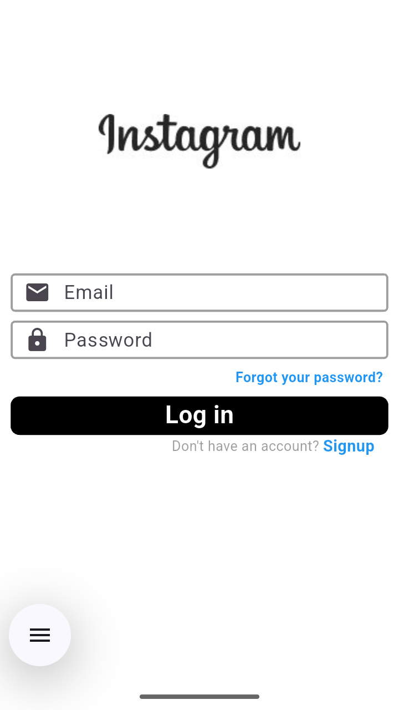
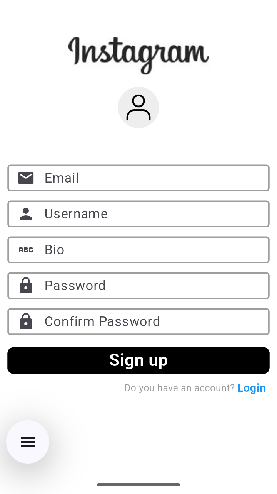

# fluttergram

This is a full stack instagram clone that uses flutter for cross-platform front-end and firebase as a cloud back-end

Currently implemented:

    - Login Page
    

    - Signup page
    

    - Auth page(no UI, selection btw Login or Signup)

Todo:

    - Homepage
    - Feed
